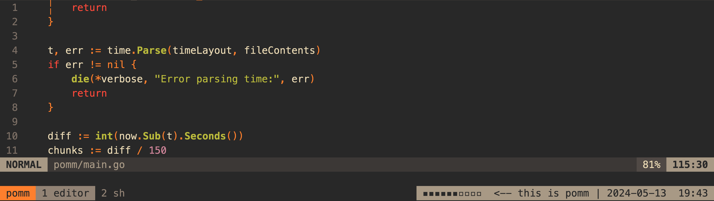
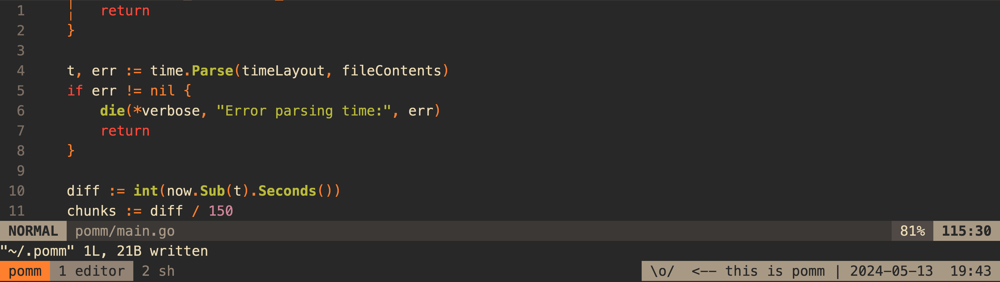

# pomm

✨ Overview
---

`pomm` is a no-frills pomodoro progress indicator intended for tmux and similar
terminal multiplexers.

A running timer:

<p align="center">
  
</p>

Once the timer finishes:

<p align="center">
  
</p>

🤔 Why
---

There are a lot of good pomodoro timers out there. I needed a super simple timer
which could display its progress in tmux's status bar (as that's where I spend
most of my time). I'm sure many of the other options can do that, I just felt
that writing one myself would be faster than trying to make the other tools work
as I need them to.

💾 Install
---

**go**:

```sh
go install github.com/dhth/pomm@latest
```

⚡️ Usage
---

### Basic Usage

- Add the following to your tmux config (or modify it accordingly)
    ```
    set -g status-right "#(pomm)"
    ```
- Ensure that your tmux status bar is set to be refreshed at a reasonable
    interval
    ```
    set -g status-interval 60
    ```
- Start a pomodoro timer with `pomm -s`
- Go on a break with `pomm -b`

### Notifying on Completion

`pomm` can run a shell command when the timer goes off. The default is `tmux
display -d 2000 "fin!"`. Configure it via:

```bash
pomm -n -nc='tmux::display-message::-d::2000::"hey, go take a break!"'
```

*`-n` dictates whether the notify command will actually run or not*

### Turn Indicator Off

```bash
pomm -o
```
